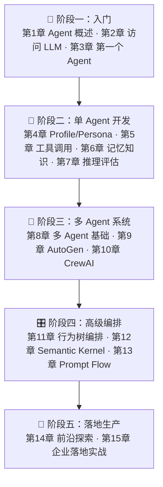

<div align="center">

# agent-learning-notes

**Agent 学习资料集合 —— 书籍整理稿与阅读笔记，沉淀 AI Agent 从入门到生产落地的完整知识体系**

[](https://github.com/JingHao-Leon/agent-learning-notes)
[](https://github.com/JingHao-Leon/agent-learning-notes/commits/main)
[](https://github.com/JingHao-Leon/agent-learning-notes)
[](./LICENSE)

[](./ai_agents_book_full.md)

</div>

---

本仓库用于沉淀个人的 Agent 学习资料与阅读整理：书籍的 Markdown 整理稿、导出 PDF，以及后续陆续补充的笔记与摘要。当前核心内容是《AI Agents 实战指南》中文整理稿 —— 基于 Micheal Lanham《AI Agents in Action》重写并大幅扩展，覆盖 **15 章 + 3 个附录**，含 70+ 图解、40+ 实战案例、100+ 中英术语对照。

## 📚 当前收录

<table>
<tr>
<td width="50%">

### 📖 《AI Agents 实战指南》
基于《AI Agents in Action》（Micheal Lanham）重写的中文整理稿。从「什么是 Agent」讲到多 Agent 协作、企业级落地，15 章循序渐进，每章配架构图解与可运行的 Python 示例。

- 📝 [Markdown 版](./ai_agents_book_full.md) —— 适合在线阅读、检索
- 📄 [PDF 版](./ai_agents_book_full.pdf) —— 适合下载收藏、离线阅读

</td>
<td width="50%">

### 🗺️ 内容覆盖
- **基础入门**（第 1-3 章）：Agent 概念、LLM 访问、第一个 Agent
- **核心组件**（第 4-7 章）：Profile、工具调用、记忆、推理评估
- **多 Agent 与编排**（第 8-13 章）：AutoGen、CrewAI、行为树、Semantic Kernel、Prompt Flow
- **前沿与落地**（第 14-15 章）：前沿主题、企业实战
- **附录**：工具速查表、中英术语表、学习路径

</td>
</tr>
</table>

## 🧭 全书知识路线

按附录 C 的推荐学习路径，全书 15 章分为五个递进阶段：



## 📋 章节目录速览

| 章节 | 主题 | 你会学到 |
|---|---|---|
| 第 1 章 | AI Agent 概述 | Agent 定义、六层架构、四层演进、五大核心组件 |
| 第 2 章 | 访问大语言模型 | OpenAI / Claude / Gemini / Ollama 等接入方式与 API 参数 |
| 第 3 章 | 构建你的第一个 Agent | Function Calling、Assistants API、日历助手等完整实战 |
| 第 4 章 | Profile 与 Persona 设计 | 角色定义、行为规范、人格化 Agent |
| 第 5 章 | Actions 与工具调用 | 工具设计、函数映射、多工具协同 |
| 第 6 章 | 记忆与知识系统 | 短期/长期记忆、向量数据库（Chroma）、RAG |
| 第 7 章 | 推理与评估机制 | CoT、自我反思、结果评估 |
| 第 8 章 | 多 Agent 系统基础 | 多 Agent 协作模式、AutoGen / CrewAI 入门 |
| 第 9 章 | AutoGen 高级应用 | 群组对话、Agent 互调、专家协作 |
| 第 10 章 | CrewAI 企业级应用 | 角色/任务/Crew、层级流程、并行执行 |
| 第 11 章 | 行为树与 Agent 编排 | py_trees 行为树、复杂任务编排 |
| 第 12 章 | Semantic Kernel 与插件系统 | 插件机制、原生函数注册 |
| 第 13 章 | Prompt Flow 与系统性评估 | 评估 rubric、对比测试、流程化管理 |
| 第 14 章 | 前沿主题深度探索 | Agent 前沿研究方向 |
| 第 15 章 | 企业落地实战 | 企业知识库 RAG、客服 Agent 完整方案 |
| 附录 A-C | 工具速查 / 术语表 / 学习路径 | 平台速查表、100+ 中英术语对照、0→1→生产路线 |

## 🚀 如何使用

- **在线阅读**：直接在 GitHub 上打开 [ai_agents_book_full.md](./ai_agents_book_full.md)，支持目录跳转与全文搜索
- **离线阅读**：进入 [ai_agents_book_full.pdf](./ai_agents_book_full.pdf) 文件页面，点击 Download 下载
- **克隆到本地**：

```bash
git clone https://github.com/JingHao-Leon/agent-learning-notes.git
```

## ❓ 常见问题（FAQ）

**Q1：这份资料和原书《AI Agents in Action》是什么关系？会有版权问题吗？**

整理稿基于 Micheal Lanham 的《AI Agents in Action》重写并大幅扩展（70+ 图解、40+ 案例、100+ 中英术语对照），属于个人学习笔记性质的内容，并非原书的中文译本。原创部分按 [MIT License](./LICENSE) 开放；如权利人要求移除相关内容，将及时配合处理（详见下方[版权与合规](#️-版权与合规)）。

**Q2：Markdown 版和 PDF 版内容一样吗？该选哪个？**

两者内容相同，PDF 即 Markdown 的导出版。在线阅读、目录跳转和全文检索建议用 [Markdown 版](./ai_agents_book_full.md)；下载收藏、离线阅读或在平板/阅读器上看可用 [PDF 版](./ai_agents_book_full.pdf)。

**Q3：零基础能直接读吗？需要什么前置知识？**

可以按附录 C 的「0 → 1 → 生产」五阶段学习路径循序渐进：第 1 章从「什么是 Agent」讲起，不需要 Agent 开发经验。从第 2 章起包含大量可运行的 Python 示例（OpenAI / Claude / Gemini / Ollama 等接入方式），建议具备基础 Python 能力，并准备一个可调用的 LLM API 或本地模型环境（LM Studio / Ollama）。

**Q4：后续还会更新吗？**

会。Roadmap 中的「分章节阅读笔记与摘要」与「更多 Agent 方向书籍/论文的整理与笔记」均在计划中，仓库持续更新。

## 📁 仓库结构

```
├── ai_agents_book_full.md    # 《AI Agents 实战指南》Markdown 整理稿（15 章 + 3 附录）
├── ai_agents_book_full.pdf   # 同内容 PDF 导出版
├── LICENSE                   # MIT License
└── README.md
```

## 🗓️ Roadmap

- [x] 《AI Agents 实战指南》整理稿（md + pdf）
- [ ] 分章节阅读笔记与摘要
- [ ] 更多 Agent 方向书籍/论文的整理与笔记

## ⚠️ 局限与已知问题（Limitations）

- **收录范围有限**：目前仅覆盖《AI Agents 实战指南》这一本整理稿，Roadmap 中的分章节阅读笔记与更多书目尚未完成，还不能作为完整的 Agent 学习资料库使用。
- **时效性风险**：书中涉及的框架与平台（AutoGen、CrewAI、Semantic Kernel、Prompt Flow、各家 LLM API 等）迭代很快，整理稿反映的是成稿时点的版本，与最新 API 和用法可能存在出入，实操时请以官方文档为准。
- **示例代码未工程化**：代码以 Markdown 内嵌片段形式给出，仓库未提供 requirements、测试或可直接运行的示例工程，复制运行时需自行补齐依赖与环境。
- **整理稿不能替代原书**：内容以概念梳理与示例串讲为主，偏学习笔记视角，无法覆盖原书及原始论文的全部细节，深度需求请回读原书与一手资料。
- **PDF 为静态导出版**：内容更新以 Markdown 为准，PDF 可能滞后于最新修订。

## ⚖️ 版权与合规

- 仓库中的整理稿为个人学习笔记性质的内容，仅供学习与交流使用。
- 如包含受版权保护的材料，发布/分发前请确保你拥有相应授权；如权利人要求移除内容，将及时配合处理。
- 仓库本身的原创内容（如本 README、后续笔记）按 [MIT License](./LICENSE) 开放。

---

<div align="center">
<sub>
个人学习沉淀，持续更新 ｜ 内容如有疏漏，欢迎 Issue 指正<br>
Made with ❤️ by <a href="https://github.com/JingHao-Leon">JingHao-Leon</a>
</sub>
</div>
